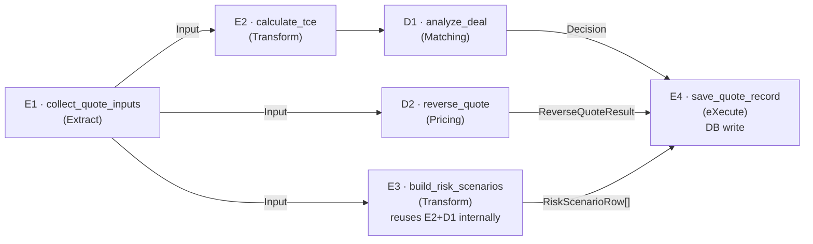
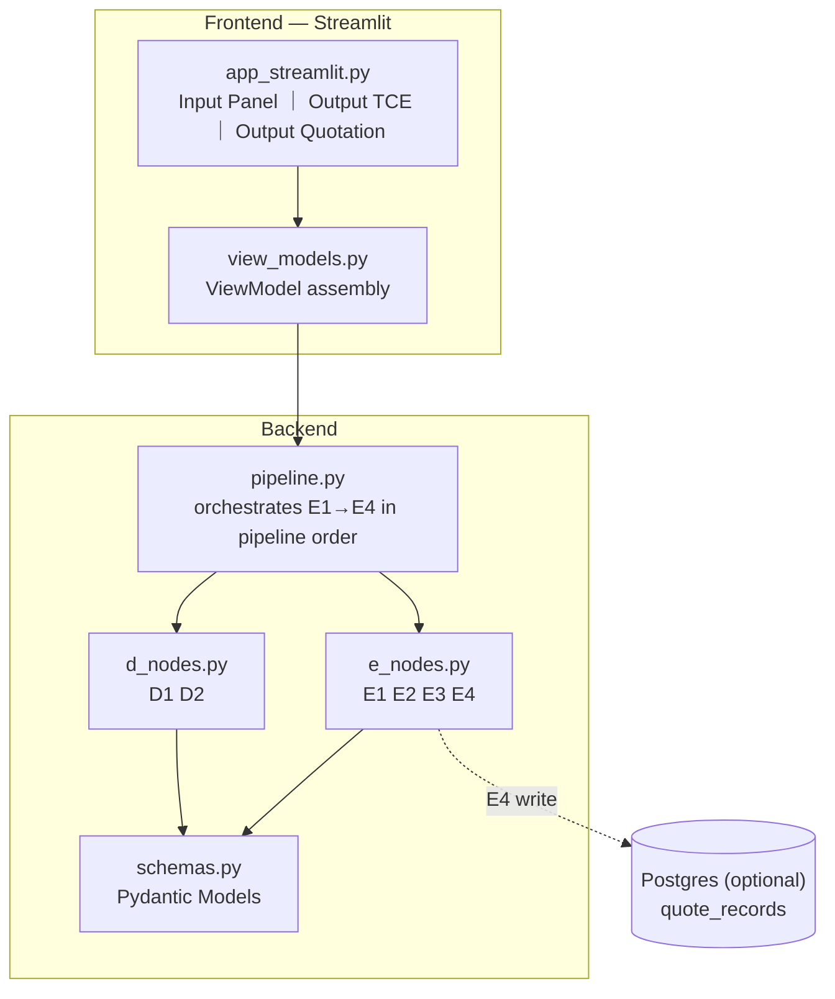

# Ship Charter Quote Copilot — Design Document

## 1. Overview

A decision-support tool for a ship **Operator (OP)** — a chartering middleman who charters a vessel **in** from a shipowner and carries cargo **for** a cargo owner. Given one fixture/voyage opportunity, the tool answers three questions at once:

1. **TCE side — Is this deal worth taking?** Compute Time Charter Equivalent (TCE, USD/day) from voyage/cost inputs, and give a binary **GO / NO-GO** verdict based on profit margin as a percentage of freight revenue.
2. **Quotation side — What rate should I quote the cargo owner?** Reverse-calculate the minimum freight rate (USD/RT) required to hit a target TCE.
3. **Owner-negotiation side — How does the current TCE compare with the shipowner's asking TCE?** Reuses the same `tce` and `spread_vs_shipowner_ask` already computed for #1, now framed as the OP's reference ceiling when negotiating hire rate with the shipowner — no new computation, just a second consumer of the same number.

**Roadmap position:**
```
Phase 1 (this round) — Manual-input-only MVP: TCE calc, binary GO/NO-GO, reverse quote, risk scenarios, quote persistence for audit/reference
Phase 2 (future)     — Real distance/bunker-price APIs (currently manual entry by design, not a placeholder)
Phase 3 (future)     — Freight-rate market benchmark engine (mirrors the TCE benchmark pattern)
Phase 4 (future)     — AI Summary (LLM-generated narrative), multi-ship comparison
```

## 2. Domain Context

The OP's workflow:

```
Cargo owner → brings cargo + their offered freight rate (USD/ton) → OP
OP → runs this tool to decide: take the job? at what rate? using which ship?
OP → negotiates with the shipowner using TCE numbers, and with the cargo owner using freight-rate numbers
```

There are **two independent decision points**, not one:

| Side | Quantity being decided | Reference comparisons (display-only, do not drive the decision) |
|---|---|---|
| TCE side | Is this voyage profitable enough? | vs. shipowner's asking TCE, vs. market benchmark TCE |
| Quotation side | What rate to quote the cargo owner? | vs. break-even rate |

**The one explicit decision rule:** profit margin, expressed as a percentage of freight revenue, must be ≥ a configurable threshold. Different operators use different thresholds — the threshold is a per-quote input, not a hardcoded constant.

**A third job reuses the TCE-side comparison without adding a new decision rule:** the OP also uses `spread_vs_shipowner_ask` as their reference ceiling when negotiating hire rate with the shipowner — same number, same node (D1), just a different consumer.

## 3. Environment

```bash
python -m venv .venv
source .venv/bin/activate
pip install -r requirements.txt

# Run frontend
streamlit run src/frontend/app_streamlit.py

# Run tests
pytest -q

# Lint + format
ruff format .
ruff check .
```

`.env` at service root (not committed): `DATABASE_URL` for the optional `quote_records` table (§7.3). Save Quote works without it — the DB write soft-fails and the CSV download still succeeds (ADR-008).

## 4. Problem Classification Routing

| Step | Output semantics | Problem class |
|---|---|---|
| Raw form input → structured input model | Information changes form | Transform |
| Input model → TCE (voyage params → day-rate) | Information changes form | Transform |
| TCE + threshold → GO or NO-GO | Select winning state (2 candidates) | Select/Rank |
| Input model + target TCE → required freight rate | Information changes form (reverse calc) | Transform |
| Input model → 5 scenario rows (each re-running the two transforms above) | Information changes form | Transform |
| Decision bundle → persisted record | Information changes form (in-memory → DB row) | Transform |

**Routing: Transform → Select/Rank → Transform (×3 parallel branches) → Transform**

## 5. Pipeline Graph

### 5.1 Diagram



### 5.2 Narrative

**E1** (`collect_quote_inputs`) takes the raw Streamlit form state (all fields manually entered — distance, bunker price, market benchmark, and shipowner's asking TCE are plain number inputs, not auto-fetched; real API integration is deferred, see §11 Future Scope) and validates it into a structured `QuoteInput` model.

**E2** (`calculate_tce`) computes voyage days (ballast + laden + port/margin), bunker consumption/cost (HFO + MGO, sea + port legs, split by ballast/laden leg), total voyage cost, net voyage income, and `tce = net_voyage_income / total_days`. A zero or negative `total_days` (e.g. all distances and port days entered as 0) is not a valid voyage — `calculate_tce` raises rather than silently returning a meaningless `tce=0`.

**D1** (`analyze_deal`) is the GO/NO-GO gate. `profit_margin_pct = (net_voyage_income - shipowner_cost) / freight_revenue × 100` (net of what's actually paid to charter the vessel in — an earlier version of this formula omitted the shipowner's hire cost entirely, which produced a misleadingly high margin for an operator business model; see ADR-007); `decision = "GO"` if `profit_margin_pct >= go_threshold_pct` else `"NO-GO"`. Also computes `operator_profit_usd` (absolute-dollar profit), `spread_vs_shipowner_ask`, and `spread_vs_market_benchmark` — **informational only**, included in the output for display but do not affect `decision`.

**D2** (`reverse_quote`) answers "if I want to hit my own target TCE, what rate do I need to quote the cargo owner?" — a purely personal pricing calculation for cargo-owner negotiation, **independent of D1's `go_threshold_pct`** (see ADR-002). Internally calls `calculate_tce` for `total_days`/`total_voyage_cost` (and inherits its zero-duration guard). Hard-fails if the rate denominator is non-positive (`quantity * (1 - commission_rate/100) <= 0`, see ADR-003).

**E3** (`build_risk_scenarios`) re-runs E2 + D1 across Base Case + 4 adjustable scenarios (Port Cost, Bunker Price, Margin Days, Freight Rate), each with a caller-overridable delta, and reports `tce_impact` (delta vs. base case) and `decision` per row. Introduces no new decision logic — purely re-applies E2/D1.

**E4** (`save_quote_record`) is the only node with a side effect (DB write). **Decoupled from the live-recompute loop on purpose**: E1→E2→D1 (and D2/E3 on demand) re-run on every form edit for instant feedback, but nothing is persisted until the user explicitly clicks **"Save Quote."** This is the point where a deliberate, audit-worthy record is created — logging every keystroke would be noise, logging only deliberate save actions is signal.

## 6. Pipeline Table

| Node | D/E | Primitive | Node Name | Business Purpose | Args | Return Type | Side Effects | Error Strategy |
|---|---|---|---|---|---|---|---|---|
| E1 · `collect_quote_inputs` | E | Extract | Quote Input Collector | Validate raw form state into a structured input model; all fields manually entered | `raw_ui_state: dict` | `QuoteInput` | — | HARD FAIL (validation error) |
| E2 · `calculate_tce` | E | Transform | TCE Calculator | Voyage days + bunker consumption/cost + total voyage cost → `net_voyage_income` → `tce` | `inputs: QuoteInput` | `TCEResult` | — | HARD FAIL (`total_days <= 0`) |
| D1 · `analyze_deal` | D | Matching | Deal GO/NO-GO Gate | `profit_margin_pct >= go_threshold_pct` → GO/NO-GO, margin net of shipowner hire cost; spreads computed for display only | `tce_result: TCEResult, inputs: QuoteInput` | `DealDecision` | — | HARD FAIL |
| D2 · `reverse_quote` | D | Pricing | Reverse Quote Calculator | Given target TCE, back-solve minimum freight rate; break-even rate net of shipowner hire cost, independent of D1's threshold | `inputs: QuoteInput, target_tce: float` | `ReverseQuoteResult` | — | HARD FAIL (zero-duration voyage; non-positive rate denominator) |
| E3 · `build_risk_scenarios` | E | Transform | Risk Scenario Builder | Re-run E2+D1 across Base Case + 4 adjustable perturbations; caller may override any scenario's delta | `inputs: QuoteInput, deltas: dict[str, float] \| None` | `list[RiskScenarioRow]` | — | HARD FAIL |
| E4 · `save_quote_record` | E | eXecute | Quote Record Saver | Persist current TCE-side + Quotation-side state as an audit-trail record for later reference | `inputs, tce_result, decision, reverse: ReverseQuoteResult \| None` | `bool` | DB write (`quote_records`) | SOFT (log + non-blocking UI warning on failure) |

## 7. Data Contracts

### 7.1 `QuoteInput` (E1 output)

```python
class QuoteInput(BaseModel):
    route: str
    cargo_description: str

    quantity: float = Field(gt=0)               # cargo qty, RT
    freight_rate: float = Field(gt=0)            # USD/RT — quoted to cargo owner
    commission_rate: float = Field(ge=0, le=100) # %

    loading_days: float = Field(ge=0)
    discharging_days: float = Field(ge=0)
    margin_days: float = Field(ge=0)             # port/weather buffer days

    ballast_distance: float = Field(ge=0)        # nm
    laden_distance: float = Field(ge=0)          # nm
    ballast_speed: float = Field(gt=0)            # knots
    laden_speed: float = Field(gt=0)              # knots

    hfo_price: float = Field(ge=0)
    mgo_price: float = Field(ge=0)
    hfo_ballast_consumption: float = Field(ge=0)
    hfo_laden_consumption: float = Field(ge=0)
    mgo_ballast_consumption: float = Field(ge=0)
    mgo_laden_consumption: float = Field(ge=0)
    hfo_port_consumption: float = Field(ge=0)
    mgo_port_consumption: float = Field(ge=0)

    port_cost: float = Field(ge=0)
    loading_cost: float = Field(ge=0)
    discharging_cost: float = Field(ge=0)
    cev_cost: float = Field(ge=0)
    ilohc_cost: float = Field(ge=0)

    market_benchmark: float = Field(ge=0)         # manual entry — display reference only
    shipowner_asking_tce: float = Field(ge=0)      # manual entry — display reference only
    go_threshold_pct: float = Field(ge=0, le=100)  # company-configurable
```

### 7.2 Outputs

```python
class TCEResult(BaseModel):
    total_days: float
    total_voyage_cost: float
    net_voyage_income: float
    tce: float

class DealDecision(BaseModel):
    decision: Literal["GO", "NO-GO"]
    reason: str
    rule_triggered: str                    # "R1" (GO) / "R2" (NO-GO)
    profit_margin_pct: float               # drives the decision
    operator_profit_usd: float             # net_voyage_income - shipowner_cost — display only
    spread_vs_shipowner_ask: float         # tce - shipowner_asking_tce — display only
    spread_vs_market_benchmark: float      # tce - market_benchmark — display only
    inputs_snapshot: QuoteInput

class ReverseQuoteResult(BaseModel):
    break_even_rate: float
    minimum_safe_rate: float    # rate that hits target_tce; independent of go_threshold_pct
    current_rate: float         # echoes QuoteInput.freight_rate

class RiskScenarioRow(BaseModel):
    scenario_name: str
    scenario_name_zh: str
    delta: float | None         # the perturbation applied; None for Base Case
    delta_step: float           # UI number_input step size for this scenario's delta
    delta_unit: str             # display unit, e.g. "USD", "%", "day", "USD/RT"; "" for Base Case
    estimated_tce: float
    tce_impact: float           # estimated_tce - base_tce
    profit_margin_pct: float
    decision: Literal["GO", "NO-GO"]
```

### 7.3 Persistence — `quote_records` (E4 side effect, optional)

```sql
-- src/backend/db/migrations/001_quote_records.sql
CREATE TABLE quote_records (
    id                  SERIAL PRIMARY KEY,
    created_at          TIMESTAMPTZ DEFAULT now(),
    route               TEXT NOT NULL,
    cargo_description   TEXT,
    quantity            NUMERIC,
    freight_rate        NUMERIC,
    commission_rate     NUMERIC,
    market_benchmark    NUMERIC,
    shipowner_asking_tce NUMERIC,
    tce                 NUMERIC,
    profit_margin_pct   NUMERIC,
    decision            TEXT,
    quote_input_snapshot    JSONB,   -- full input snapshot, for audit/reference
    deal_decision_snapshot  JSONB,   -- full DealDecision
    reverse_quote_snapshot  JSONB    -- full ReverseQuoteResult; NULL if reverse quote unused
);
```

### 7.4 Contract Test Scenarios (representative sample — full list in `tests/`)

**D1 · `analyze_deal`**

| ID | Scenario | Input condition | Expected |
|---|---|---|---|
| D1-S01 | GO | `profit_margin_pct >= go_threshold_pct` | `decision="GO"` |
| D1-S02 | NO-GO | `profit_margin_pct < go_threshold_pct` | `decision="NO-GO"` |
| D1-S03 | Boundary | `profit_margin_pct == go_threshold_pct` | `decision="GO"` (`>=` includes equality) |
| D1-S04 | Shipowner cost subtracted | `shipowner_asking_tce > 0` | margin is strictly less than the pre-subtraction figure |
| D1-S05 | Shipowner cost can flip decision | Same voyage economics, `shipowner_asking_tce=0` vs a positive value | `GO` vs `NO-GO` respectively |

**D2 · `reverse_quote`**

| ID | Scenario | Input condition | Expected |
|---|---|---|---|
| D2-S01 | Rate ordering | `target_tce > shipowner_asking_tce` | `minimum_safe_rate >= break_even_rate` |
| D2-S02 | `go_threshold_pct` has no effect | Same inputs except `go_threshold_pct` varied | `minimum_safe_rate`/`break_even_rate` identical regardless |
| D2-S03 | Failure — rate denominator non-positive | `commission_rate=100` | `ValueError`, HARD FAIL |

**E3 · `build_risk_scenarios`**

| ID | Scenario | Input condition | Expected |
|---|---|---|---|
| E3-S01 | Scenario coverage | — | Base Case, Port Cost, Bunker Price, Margin Days, Freight Rate |
| E3-S02 | Override delta | `deltas={"port_cost": 9000.0}` | Only the Port Cost row's `delta`/`estimated_tce` change; other rows match the no-override output |
| E3-S03 | Perturbed-input validation | A perturbation that drives a field negative | Re-validated, not passed through unchecked |

**E2 · `calculate_tce`**

| ID | Scenario | Input condition | Expected |
|---|---|---|---|
| E2-S01 | Zero-duration guard | `total_days <= 0` | `ValueError`, HARD FAIL |

**E4 · `save_quote_record`**

| ID | Scenario | Input condition | Expected |
|---|---|---|---|
| E4-S01 | Failure — soft fallback | DB connection failure, or `DATABASE_URL` not configured | Logged, no exception raised, returns `False` |

## 8. Diagrams

### 8.1 Software Architecture



### 8.2 Sequence — Live Preview vs. Explicit Save

```mermaid
sequenceDiagram
    actor User
    participant FE as Frontend (Streamlit)
    participant PIPE as pipeline.py
    participant DB as Postgres

    rect rgb(40,40,40)
    Note over User,PIPE: Live preview loop (no DB write, re-runs on every input change)
    User->>FE: Edits a field in the Input panel
    FE->>PIPE: E1 collect_quote_inputs(raw_ui_state)
    PIPE->>PIPE: E2 calculate_tce(QuoteInput)
    PIPE->>PIPE: D1 analyze_deal(TCEResult)
    PIPE-->>FE: TCEResult + DealDecision
    FE-->>User: Output TCE panel refreshes live

    opt User entered a Target TCE
        User->>FE: Enters Target TCE
        FE->>PIPE: D2 reverse_quote(QuoteInput, target_tce)
        PIPE-->>FE: ReverseQuoteResult
        FE-->>User: Output Quotation panel refreshes live
    end
    end

    rect rgb(60,40,40)
    Note over User,DB: Explicit save (the only point of a DB write)
    User->>FE: Clicks "Save Quote"
    FE->>PIPE: E4 save_quote_record(...)
    PIPE->>DB: INSERT INTO quote_records
    alt Write failed
        PIPE-->>FE: SOFT fallback
        FE-->>User: Shows "save failed"; calculated results still display normally
    else Write succeeded
        PIPE-->>FE: Success
        FE-->>User: Confirmation "Saved"
    end
    end
```

## 9. Project Structure

```
ship-charter-quote-copilot/
├── docs/
│   ├── design_backend.md
│   └── design_frontend.md
├── src/
│   ├── frontend/
│   │   ├── app_streamlit.py     ← Input panel ｜ Output TCE ｜ Output Quotation
│   │   ├── state.py             ← session state contract
│   │   └── view_models.py
│   └── backend/
│       ├── e_nodes.py           ← E1 E2 E3 E4
│       ├── d_nodes.py           ← D1 D2
│       ├── pipeline.py
│       ├── schemas.py
│       ├── db_results.py        ← save_quote_record
│       └── db/
│           └── migrations/
│               └── 001_quote_records.sql
├── tests/
├── scripts/
│   └── run_demo.py              ← CLI smoke test, no mocks, no DB write
├── .gitignore
└── requirements.txt
```

## 10. Task list and implementation status

| Task | Status | Scope | Description |
|---|---|---|---|
| T1 | ✅ Done | schemas.py | All Pydantic models (§7.1–7.2) |
| T2 | ✅ Done | E1 | `collect_quote_inputs` |
| T3 | ✅ Done | E2 | `calculate_tce`, including the zero-duration guard and ballast/laden bunker split |
| T4 | ✅ Done | D1 | `analyze_deal` — binary GO/NO-GO, shipowner-cost-netted margin, `operator_profit_usd` |
| T5 | ✅ Done | D2 | `reverse_quote` — target-TCE-only formula, non-positive-denominator guard |
| T6 | ✅ Done | E3 | `build_risk_scenarios` — 5-row table, stable per-scenario keys, caller-supplied deltas |
| T7 | ✅ Done | db | Postgres table + migration (optional — app runs without it) |
| T8 | ✅ Done | E4 | `save_quote_record` — soft-fail on any DB error |
| T9 | ✅ Done | pipeline.py | Thin wrapper functions matching the independently-triggered branches (live preview, on-demand reverse quote/risk, explicit save) |
| T10 | ✅ Done | pipeline.py | `run_quotation_sandbox` — bidirectional rate↔TCE solve for the Quotation Side sandbox |
| T11 | ✅ Done | frontend | Streamlit UI bound to the real pipeline (no mock fixtures) |
| T12 | ✅ Done | tests | 116 tests covering every pipeline stage, the session-state FSM, and the ViewModel boundary |

## 11. Future Scope (explicitly deferred, not built this round)

1. **Bunker price automation** — port/route-based estimation; currently manual entry by design.
2. **Distance API automation** — currently manual entry by design.
3. **Vessel speed/consumption lookup** — auto-fill table by vessel type; currently manual entry.
4. **Freight-rate market benchmark engine** — mirrors the TCE benchmark pattern but for the per-ton freight rate quoted to the cargo owner, plus its own GO/NO-GO gate.
5. **AI Summary** — LLM-generated narrative tab. Deliberately not built this round, to avoid an API cost/reliability dependency before the core decision logic is validated.
6. **Multi-ship comparison** — compare this voyage's TCE against alternative vessels for the same cargo.
7. **Negotiation round log** — capture the Quotation Side sandbox state (rate/TCE/shipowner ask/margin/decision/timestamp) into a growing in-session table, so the OP can trace a multi-round back-and-forth negotiation. This round ships only the single-state sandbox (no round history).

## 12. Architectural Decision Records

### ADR-001 — Binary GO/NO-GO Decision Rule

**Status:** Accepted

**Context:** An earlier prototype produced a 4-state decision (`GO` / `GO WITH CAUTION` / `NEGOTIATE` / `NO-GO`) driven by comparing TCE against the shipowner's asking TCE, a market benchmark, and a dollar-amount risk buffer. In practice the actual GO/NO-GO criterion operators use is a single rule: profit margin as a percentage of freight revenue must clear a threshold.

**Decision:** Replace the 4-state logic entirely with `decision = "GO" if profit_margin_pct >= go_threshold_pct else "NO-GO"`. The shipowner/benchmark comparisons are retained as **display-only** fields — useful context, but they no longer drive `decision`.

**Consequences:** The dollar-amount risk buffer field is removed from inputs.

### ADR-002 — Reverse Quote Uses Target TCE Only, Not the GO Threshold

**Status:** Accepted

**Context:** An earlier version of `reverse_quote` reused `go_threshold_pct` (D1's company-wide GO/NO-GO floor) on the theory that this kept the two decision rules "consistent." This conflates two unrelated questions. D1 answers "is this deal worth taking, company-wide" (uses the threshold). D2/`reverse_quote` answers a completely different, purely personal question asked during cargo-owner negotiation: "if *I* want to hit *my own* target TCE, what rate do I quote?"

**Decision:** `reverse_quote(inputs, target_tce)` ignores `go_threshold_pct` entirely. `minimum_safe_rate` is solved purely from `target_tce`. `break_even_rate` is unchanged (the rate at which margin = 0, independent of both the threshold and the target).

**Consequences:** `go_threshold_pct` is still read by D1; D2 never touches that field. No contract or schema change — only the internal formula and its design narrative were corrected.

### ADR-003 — D2 Hard-Fails When the Rate Denominator Is Non-Positive

**Status:** Accepted

**Context:** `reverse_quote`'s rate formulas divide by `quantity * (1 - commission_rate / 100)`. `commission_rate` is schema-valid up to 100, at which point this denominator hits zero — a naive safe-division guard would silently return `0.0` for both rates, producing a nonsensical "quote $0/ton" instead of surfacing that a 100% commission makes any rate quote meaningless.

**Decision:** `reverse_quote` raises when `quantity * (1 - commission_rate / 100) <= 0`, instead of letting a safe-division guard mask it. A guard that defaults to zero is appropriate when zero is a legitimate value to display, but not when it produces an economically meaningless number a human could mistake for a real quote.

**Consequences:** `commission_rate == 100` (schema-valid) now hard-fails inside D2 specifically — D1 and E3 are unaffected since neither divides by this denominator.

### ADR-004 — `save_quote_record` Returns `bool`, Not `None`

**Status:** Accepted

**Context:** The frontend needs to distinguish "write failed → show 'save failed'" from "write succeeded → show 'Saved.'" A function that always returns `None` gives the caller no way to tell which happened.

**Decision:** `save_quote_record(...) -> bool` — returns `True` on a successful insert, `False` when the DB write failed (already logged internally per the SOFT error strategy — the `bool` is purely for the frontend to pick the right message, not the failure-handling mechanism itself).

**Consequences:** `save_quote_record` still never raises on a DB failure; it just now reports which branch happened.

### ADR-005 — Bidirectional Rate↔TCE Sandbox Reuses D1/D2, No New Decision Logic

**Status:** Accepted

**Context:** The Quotation Side panel lets the OP edit either Freight Rate or Target TCE (the other recalculates) and independently adjust Shipowner Ask, with a live GO/NO-GO + margin readout. Computing that GO/NO-GO comparison in the frontend would mean reimplementing D1's threshold logic outside D1.

**Decision:** Added `run_quotation_sandbox(inputs, target_tce=None, sandbox_freight_rate=None, sandbox_shipowner_ask=None)` to the pipeline layer, returning a named result model (`{resolved_freight_rate, resolved_tce, break_even_rate, decision}`). Exactly one of `target_tce`/`sandbox_freight_rate` must be given; the other direction is solved by perturbing the input and re-running E2/D2, the same perturb-and-rerun pattern E3 already uses. Either direction then re-runs D1 on the resolved (rate, TCE) pair — no new threshold logic, D1's existing rule is reused as-is.

**Consequences:** Pure composition of already-built D1/D2/E2 — no change to any of their contracts. The sandbox's independent "Shipowner Ask" override is threaded into every formula that reads the underlying quantity (not just its original consumer) — a general lesson worth stating explicitly: when a shared input's role changes, every consumer of that input needs auditing, not just the one that prompted the change.

### ADR-006 — Risk Scenarios: Stable Keys Decoupled from Display Names, Caller-Supplied Deltas

**Status:** Accepted

**Context:** The Risk Analysis table redesigned into 5 always-visible rows (Base Case + 4 adjustable scenarios), each with an OP-editable delta and its own step/unit, merging two opposite-direction freight-rate scenarios into one signed-delta row. The original implementation only computed a fixed set of scenarios with the delta magnitude baked into the display string, and accepted no parameters.

**Decision:** `build_risk_scenarios(inputs, deltas=None)` keys each scenario by a stable snake_case identifier, decoupled from the human-readable display name — the display name no longer embeds the delta magnitude, since the magnitude is now a separate, independently-editable field. A caller may override any scenario's delta; unspecified scenarios fall back to their default.

**Consequences:** The frontend reads each row's current override keyed by scenario identity rather than row position — so reordering or adding scenarios later can't silently mis-key a delta to the wrong row.

### ADR-007 — Profit Margin and Break-even Rate Net Out the Shipowner's Hire Cost

**Status:** Accepted

**Context:** An earlier version of `profit_margin_pct` deliberately didn't subtract the shipowner's hire cost — it was stated purely in terms of the cargo-side freight margin. Testing against a representative voyage profile surfaced that this produces a misleadingly high margin for an **operator** business model — this kind of company charters a vessel **in** from a real shipowner and charters **out** to a cargo owner; the cost side only deducted bunker/port/cargo-handling costs, never what's actually paid to the shipowner for the hire.

**Decision:** `analyze_deal` (D1) now computes `shipowner_cost = shipowner_asking_tce × total_days` and `profit_margin_pct = (net_voyage_income - shipowner_cost) / freight_revenue × 100` — the operator's real bottom-line margin after paying to charter the vessel in. `reverse_quote` (D2)'s `break_even_rate` is updated for internal consistency to the same "zero profit" anchor.

**Consequences:** `minimum_safe_rate == break_even_rate` now holds at `target_tce == shipowner_asking_tce` (the point where the OP's personal target exactly matches what's owed to the shipowner) rather than at `target_tce == 0`. The sandbox's independent shipowner-ask override needed a follow-up fix to be threaded into every formula that reads the underlying quantity (see ADR-005's note on auditing every consumer, not just the original one).

### ADR-008 — `DealDecision` Gains `operator_profit_usd` (Absolute-Dollar Profit)

**Status:** Accepted

**Context:** Post-ADR-007, the UI shows `profit_margin_pct` (a %) and `spread_vs_shipowner_ask` (a $/day rate), but never the absolute dollar amount the OP actually pockets on this voyage net of the shipowner's hire cost — the single number most operators want first when sizing up a deal.

**Decision:** `DealDecision` gains `operator_profit_usd: float`, computed in `analyze_deal` (D1) as `net_voyage_income - shipowner_cost` — the same numerator already computed for `profit_margin_pct`, just exposed as its own field. Display-only, does not feed the GO/NO-GO rule.

**Consequences:** Surfaced on both the TCE Side and the Quotation Side sandbox as a KPI card.

## 13. Known Issues / Open Questions

- **Whether shipowner-ask/market-benchmark comparisons should algorithmically feed D1's decision** (vs. display-only, as currently designed) — does not block the current scope; `DealDecision` already exposes both spreads, so adding them to the decision rule later is a small change, not a redesign.
- **Freight-rate GO/NO-GO threshold** (Future Scope item 4) — no calibrated value yet; needs real usage data first.
