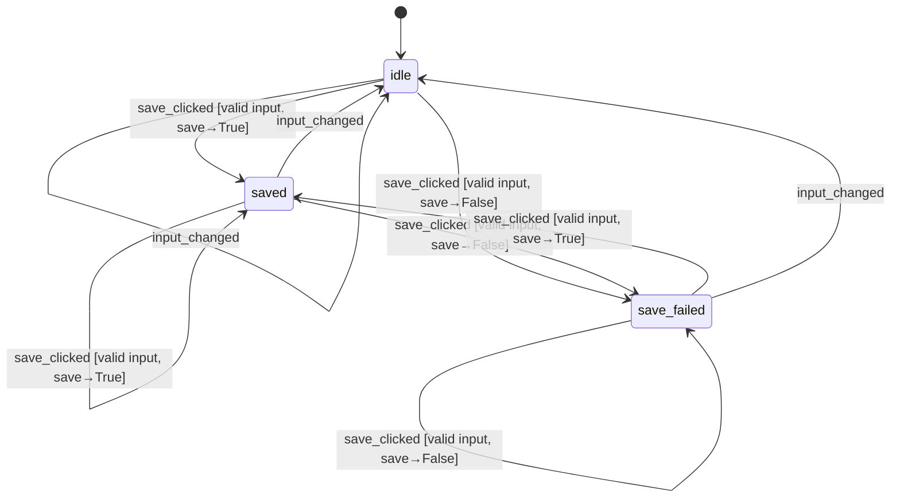
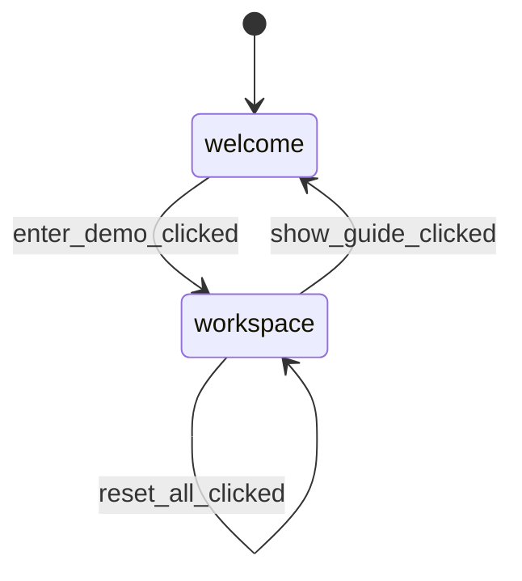

# Ship Charter Quote Copilot — Frontend Design Document

**Summary:** A single-screen Streamlit workspace. Unlike a job-queue app (upload → spinner → results), every computation here is a fast, synchronous, pure function — there is no `RUNNING` state. The TCE Side panel is a strict mirror of the real Input form (no separate editing); the Quotation Side panel is a **sandbox** — Target TCE and Freight Rate are bidirectionally linked (edit either, the other recalculates), and Shipowner Ask is a third, independently-editable value (simulating the next round of the shipowner's counter-offer) used only for the sandbox's spread display. The only true state machine in this app tracks save feedback after the explicit "Save Quote" click — the sandbox's bidirectional recompute is live derived data, same category as the TCE Side panel, not a discrete state machine.

A second, page-level screen — a **Welcome screen** shown on first load, explaining the demo flow — plus a workspace-level **"↺ Reset All"** action let the OP clear the pre-filled sample voyage and enter their own real numbers without hand-clearing 21 fields. Both are documented as a second, independent FSM ("Page View FSM") separate from the save-feedback FSM.

## Step 4. Feature List

| Module | Feature | Description | Priority |
|---|---|---|---|
| Input | Voyage/Cargo/Cost Input Form | All voyage/cargo/cost fields, hand-entered (no API auto-fill, by design) | High |
| TCE Side | GO/NO-GO Verdict | Total freight revenue + TCE + GO/NO-GO + margin, recomputed live on every input change | High |
| TCE Side | Shipowner Comparison | Shipowner ask + spread, flagged when negative | High |
| Quotation Side | Rate↔TCE Sandbox | Bidirectional: edit Target TCE or Freight Rate, the other recalculates | High |
| Quotation Side | Independent Shipowner Ask | A separate, freely-editable Shipowner Ask used only for the sandbox's spread display — simulates the shipowner's next counter-offer without touching the real Input | High |
| Quotation Side | Sandbox GO/NO-GO + Break-even | Margin% / GO-NO-GO at the sandbox's current rate (reuses D1), plus break-even rate | High |
| Quotation Side | Reset to Current Quote | One click reseeds all 3 sandbox values from the live Input-driven quote | High |
| Risk | Risk Scenario Table | Always-visible 5-row scenario table, each row's delta editable, TCE impact + decision per row | Low |
| Persistence | Save Quote Button | Explicit save action; non-blocking success/failure feedback | High |
| Onboarding | Welcome Screen | First-load screen: explains the demo flow, tells the OP a pre-filled sample voyage is already loaded. Revisitable via a "Guide" button in the workspace header | Medium |
| Global Actions | Reset All | One click blanks all 21 Input fields (and resets the sandbox + risk deltas + save status) so the OP can replace the sample voyage with their own data | Medium |
| Input | Run | Explicit submit button at the bottom of the Input panel — first computation only happens on click, not on every keystroke; once clicked, the panels go back to live recompute on every edit | High |

## Step 5. Screen Action Matrix

There are two screens — Welcome (first-load only) and Quote Workspace, gated by a `view` field in session state. "State Change" below refers to either the save-feedback FSM or the page-view FSM, where applicable; sandbox recomputation is live derived data, not a state transition.

| Screen | User Action | Backend Call | State Change | Expected UI |
|---|---|---|---|---|
| Welcome | Clicks "Enter Demo →" | none | `view` → `"workspace"` | Quote Workspace renders, pre-filled with the sample voyage |
| Quote Workspace | Clicks "Guide" (header) | none | `view` → `"welcome"` | Welcome screen renders again |
| Quote Workspace | Clicks "↺ Reset All" | none — reseed only | All 21 input widgets ← blank; sandbox + risk-delta widgets ← popped; session replaced with a fresh state (`has_run` → `False`, `save_status` → `idle`) | Input panel shows 21 blank fields; output panels hidden behind a "fill in Input, then click Run" banner |
| Quote Workspace | Edits any Input field, `has_run` is `True` | Core pipeline (collect → TCE → decision) | `save_status` → `idle` if previously `saved`/`save_failed` | TCE side panel refreshes live; sandbox panel also refreshes against the fresh inputs |
| Quote Workspace | Clicks "Run" (bottom of Input panel, only shown while `has_run` is `False`) | none yet — just flips the gate | `has_run` → `True` | Run button disappears; TCE side panel computes and renders for the first time this session (or since the last Reset All) |
| Quote Workspace | Edits any Input field, `has_run` is `True`, but the edit makes input invalid | Validation error | — (not a state transition) | Banner naming every missing/invalid field by label; output panels not rendered until the error clears |
| Quote Workspace | Edits Target TCE (sandbox) | Sandbox solve, target-TCE direction | `sandbox_last_edited` → `"target_tce"` | Sandbox Freight Rate field recalculates; revenue/break-even/margin/GO-NO-GO refresh |
| Quote Workspace | Edits Freight Rate (sandbox) | Sandbox solve, freight-rate direction | `sandbox_last_edited` → `"freight_rate"` | Sandbox Target TCE field recalculates; revenue/break-even/margin/GO-NO-GO refresh |
| Quote Workspace | Edits Shipowner Ask (sandbox) | none — pure arithmetic in the ViewModel | — | Spread + negative-spread warning refresh; sandbox rate/TCE unaffected |
| Quote Workspace | Clicks "↺ Reset to current quote" | none — reseed only | sandbox fields ← live Input-driven values | Sandbox panel reverts to exactly mirror the TCE Side panel |
| Quote Workspace | Edits a Risk Scenario's delta | Risk scenarios re-run with the OP's delta in place of the default | — | That row's Est. TCE / TCE Impact / Margin / Decision refresh; other rows unaffected |
| Quote Workspace | Clicks "Save Quote" (valid input) | Save pipeline | `save_status` → `saved` or `save_failed` | "Saved" confirmation, or non-blocking "save failed" warning (computed values stay visible either way) |

## Step 5b. Interaction Investment Level

| Interaction | Primitive | Tier | Reason |
|---|---|---|---|
| Enter Inputs | Input | Better | Grouped by category + collapsed sections + per-field validation — not a flat, ungrouped form |
| GO/NO-GO Verdict | Summarize | **Best** | Dashboard / KPI-card layout — the core decision output and the tool's main selling point, not a table or bare number |
| Shipowner Compare | Compare | Good | Display-only secondary context — simple side-by-side numbers |
| Rate↔TCE Sandbox | Adjust | **Best** | Multi-value bidirectional recompute + an independently-movable shipowner ask — the negotiation-experimentation centerpiece, not a one-way single input |
| Sandbox GO/NO-GO + Break-even | Summarize | Better | Break-even rate + GO/NO-GO badge + margin% is a small set of values, not a single number |
| Risk Scenarios | Compare | Good | Deliberately scoped as "nice to have," not the core loop |
| Save Quote | Confirm | Good | A button + toast/banner is enough; no preview/undo needed for a low-stakes, reversible save |
| Welcome Screen | Select | Good | Static explanation + one "Enter Demo" button — no branching choice, just a one-way gate into the workspace |
| Reset All | Confirm | Good | A button + immediate effect — no preview/undo; low-stakes since nothing is persisted until "Save Quote" |

## Step 6. ASCII Wireframe

**Welcome screen (first load only):**

```
┌──────────────────────────────────────────────────────────────────────────────┐
│  Ship Charter Quote Copilot                                                  │
├──────────────────────────────────────────────────────────────────────────────┤
│  Welcome                                                                      │
│                                                                                │
│  This is a product demo for a charter-quote calculation tool.                │
│  A sample voyage is pre-filled so you can view results immediately.          │
│                                                                                │
│  How to use:                                                                  │
│  1. Input — fill in voyage/cargo/cost details on the left                    │
│  2. Estimated TCE — see the equivalent daily rate, GO/NO-GO, net profit      │
│  3. Reverse Quote — solve for a target rate, simulating a negotiation        │
│  4. Risk Analysis — see how each cost driver affects the result              │
│  5. Save Quote — export the calculation as a CSV                             │
│                                                                                │
│  Want to try your own numbers? Enter the demo, then click "↺ Reset All."     │
│                                                                                │
│                                                       [   Enter Demo →   ]    │
└──────────────────────────────────────────────────────────────────────────────┘
```

**Quote Workspace:**

```
┌──────────────────────────────────────────────────────────────────────────────┐
│  Ship Charter Quote Copilot                              [Guide]  [↺ Reset All]│
├───────────────────────────────┬────────────────────────────────────────────────┤
│  INPUT                        │  OUTPUT — TCE Side                           │
│                                │  Total Freight Revenue:  200,000.00          │
│  Route          [__________]  │  Estimated TCE:        21,244.74 USD/day     │
│  Cargo          [__________]  │  Shipowner Ask: 2,800.00 | Spread: +18,444.74│
│  Quantity (RT)  [__________]  │  ●  GO   (margin 58.41%)                     │
│  Freight Rate   [__________]  │  ⚠ shown only if spread < 0                  │
│  Commission %   [__________]  │                                               │
│  ... (port/bunker/distance     │  ────────────────────────────────            │
│       fields, scrollable)      │  OUTPUT — Quotation Side    [↺ Reset to current quote] │
│  Shipowner Ask  [__________]  │                                               │
│  Market Bench.  [__________]  │  Target TCE [...]  ⇄  Freight Rate [...]     │
│  GO Threshold % [__________]  │  Total Freight Revenue: ...                  │
│                                │  Shipowner Ask [...] | Spread: ...           │
│  [        Run / 运行        ] │  Break-even Rate:      ...                   │
│                                │  ●  GO/NO-GO   (margin ...%)                 │
│                                │  ⚠ shown only if spread < 0                  │
│                                │                                               │
│                                │  ▸ Risk Scenarios (always visible)            │
│                                │    [5-row table, each delta editable]        │
│                                │                                               │
│                                │  [ Save Quote ]   ✓ Saved                     │
└───────────────────────────────┴────────────────────────────────────────────────┘
```

The OUTPUT column above only renders **after** a successful "Run" click with valid input. Before that — first load, right after "↺ Reset All" — the entire OUTPUT column is replaced by a single banner under an "Estimated TCE" header, aligned with the Input panel's first box.

**Notes:**
- Market Benchmark is still collected in the Input panel (required by the input model, no backend change) but its spread is **not rendered** anywhere in this version — a display-only scope cut, deferred to Future Scope alongside a full Market Benchmark Engine.
- Negotiation round-by-round history tracing is **not** built this round — deferred to Future Scope; this sandbox holds only the current/latest experiment, no log.
- Target TCE and Freight Rate in the sandbox are both editable widgets; Shipowner Ask in the sandbox is also an editable widget, distinct from (and initially seeded from) the real Input form's shipowner-ask value.

## Step 7. Technical Design (State, Contracts, Errors)

### Artifact 1 — UI State Machine

There are two independent, small FSMs: **save feedback** and **page view** (Welcome ↔ Quote Workspace). The Quotation Side sandbox's bidirectional recompute is live derived data recomputed on every relevant widget change, same category as the TCE Side panel — it is **not** part of either FSM, has no discrete named states, and never blocks or gates anything.

**Run gate — a one-way unlock, not a staleness check:** the OP must click **"Run"** once before the TCE/Quotation/Risk/Save panels appear at all (this addresses first-time-user confusion right after Reset All, when the form is blank and nothing has a natural place to show yet). An earlier version of this gate also made editing *any* Input field after a successful Run go stale again, forcing another Run click every time — in practice this read as a regression of the tool's core "edit Input → see TCE update live" loop, traded away to fix a comparatively rare edge case. The gate is a plain one-way `bool`: once `True`, every panel goes back to live recompute on every Input edit, exactly like before the gate existed, until "↺ Reset All" sets it back to `False`. The Run button itself is only rendered while the gate is `False` — once clicked, it disappears for the rest of the session (or until the next Reset All).

**Save Feedback FSM:**



`save_clicked` with invalid input is **not** a state transition — the inline field error is shown, `save_status` is left unchanged.

**Page View FSM:**



`reset_all_clicked` is a self-loop, not a `view` change — it stays in `workspace` and only patches the other session-state fields. Like the sandbox events, these are plain direct session-state patches handled by the app layer — no dedicated pure FSM function, since there is no branching/guard logic to make testable in isolation (unlike the save FSM, which has real guard conditions across 3 states and 2 events).

### Artifact 2 — Session State Contract

```python
class QuoteSessionState(BaseModel):
    save_status: Literal["idle", "saved", "save_failed"] = "idle"

    # Quotation Side sandbox — None until the app's first-render seeding step runs
    sandbox_target_tce: float | None = None
    sandbox_freight_rate: float | None = None
    sandbox_shipowner_ask: float | None = None
    sandbox_last_edited: Literal["target_tce", "freight_rate"] | None = None

    # Page View FSM — which screen is shown
    view: Literal["welcome", "workspace"] = "welcome"

    # Run gate — one-way bool, not a staleness flag
    has_run: bool = False

    inputs_blanked: bool = False
```

Raw form field values (the 21 input fields) are **not** duplicated here — they live under Streamlit's own widget keys and are validated into the input model on every rerun.

**Reset All behavior:** "↺ Reset All" pops every input widget's key out of session state (rather than assigning blank values directly, which would conflict with Streamlit's widget-value API) and sets a flag so each widget's next render passes a blank `value=` instead of the sample-voyage default. It also pops the sandbox widget keys and any risk-delta keys, and replaces the session with a fresh state.

**Seeding behavior:** on first app load, and on every Reset click, the app layer seeds the sandbox to exactly mirror the TCE Side panel, then it diverges as the OP experiments.

### Artifact 3 — Event → State Transition Table

| Current State | Event | Guard | Next State | State Patch |
|---|---|---|---|---|
| idle | save_clicked | valid input, save → `True` | saved | `{save_status: "saved"}` |
| idle | save_clicked | valid input, save → `False` | save_failed | `{save_status: "save_failed"}` |
| saved | save_clicked | valid input, save → `True` | saved | `{save_status: "saved"}` |
| saved | save_clicked | valid input, save → `False` | save_failed | `{save_status: "save_failed"}` |
| save_failed | save_clicked | valid input, save → `True` | saved | `{save_status: "saved"}` |
| save_failed | save_clicked | valid input, save → `False` | save_failed | `{save_status: "save_failed"}` |
| saved | input_changed | — | idle | `{save_status: "idle"}` |
| save_failed | input_changed | — | idle | `{save_status: "idle"}` |
| idle | input_changed | — | idle | — (no-op) |

Any other `(state, event)` combination is unrecognised and must hard-fail inside the transition function. Invalid input is handled *before* the transition function is called — a validation error short-circuits the click handler, so the FSM never sees that case at all. Sandbox events and the Page View FSM's events are deliberately **not** in this table — they patch session state directly and are not part of the save-status FSM.

### Artifact 4 — Frontend Pipeline Table

| Node | D/E | Primitive | Node Name | Business Purpose | Side Effects | Error Strategy |
|---|---|---|---|---|---|---|
| ViewModel Builder | E | Transform | Quote ViewModel Builder | Flatten already-computed backend outputs into one render-ready ViewModel. Does **not** call any backend function itself — receives already-computed results and just flattens them | — | HARD FAIL on missing required field |
| Save-State Transition | E | Select | Save-State Transition | Pure FSM transition per Artifact 3 — UI control flow, not a business decision | — | HARD FAIL on unrecognised `(state, event)` |
| Save Trigger | E | eXecute | Save Trigger | The only frontend node with a side effect — delegates to the backend save function | Delegates to backend (DB write) | SOFT (mirrors backend — never raises, returns `bool`) |

No decision node: the frontend makes no business decision (GO/NO-GO is the backend's job, reused as-is by the sandbox solve; the frontend only displays it). Sandbox Reset, Reset All, the Welcome↔Workspace view toggle, and the Run gate's flip are all plain session-state patches handled by the app layer — no dedicated node, no side effect.

**Boundary rule:** every backend call is made by the **app layer** (the main Streamlit script, reacting to a widget event), never by the ViewModel builder. The ViewModel builder only ever receives already-computed results as plain arguments and flattens them.

### Artifact 5 — ViewModel Contract

```python
class QuoteViewModel(BaseModel):
    # TCE side
    freight_revenue: float
    tce: float
    decision: str                       # "GO" | "NO-GO"
    profit_margin_pct: float
    operator_profit_usd: float
    shipowner_asking_tce: float
    spread_vs_shipowner_ask: float
    owner_side_negative_spread: bool

    # Quotation side sandbox — all None/False until the app's seeding step has run once
    quotation_freight_rate: float | None = None
    quotation_tce: float | None = None
    quotation_freight_revenue: float | None = None
    quotation_break_even_rate: float | None = None
    quotation_decision: str | None = None
    quotation_profit_margin_pct: float | None = None
    quotation_operator_profit_usd: float | None = None
    quotation_shipowner_ask: float | None = None
    quotation_spread_vs_shipowner_ask: float | None = None
    quotation_owner_side_negative_spread: bool = False

    # Risk side — None until the user expands the section
    risk_rows: list[dict] | None = None

    # Save feedback
    save_status: str = "idle"
```

### Artifact 6 — Render Contract

| Component | Output | Side Effects |
|---|---|---|
| Welcome screen | Full English explanation block, then full Chinese block, "Enter Demo" button | On click: `view = "workspace"`, rerun |
| Header controls | "Guide" button + "↺ Reset All" button | "Guide": `view = "welcome"`, rerun. "Reset All": blanks all input keys, pops sandbox/risk-delta widget keys, replaces session state, reruns |
| Input panel | Input widgets, inline validation errors | — |
| Run button (only rendered while the gate is `False`) | "Run" primary button, bottom of the Input panel | Returns whether it was clicked this rerun; flips the gate to `True` |
| TCE panel | Hero row (Estimated TCE / Decision badge) + compact row (Revenue / Owner Ask / Spread / Net Profit / Profit Margin) / negative-spread warning banner | — |
| Quotation panel | Reset button, paired Target-TCE/Freight-Rate/Shipowner-Ask inputs, hero row (Break-even Rate / Decision badge) + compact row | Writes sandbox fields via `on_change` callbacks; Reset clears those fields plus the widget-level keys and reruns |
| Risk panel | Always-visible table, editable per-scenario delta + Est. TCE / TCE Impact / Margin / Decision columns | Each row's delta widget is read back on the next rerun, keyed by stable scenario identifier |
| Save button | "Save Quote" button + status banner | On click, builds a fresh snapshot and calls the save pipeline, then the save-state transition with the real result |

Render functions don't reach into the sandbox/risk-scenario backend calls on their own — those stay an app-layer concern. The one exception is the Save button, which calls the save pipeline directly on its own click, since the save snapshot must be built fresh at the moment of the click, not reused from the panel's last-rendered ViewModel.

**Bilingual button-label convention:** for a single-screen demo like this one, EN/ZH labels are stacked in one button label (EN bold/larger on top, ZH thin/smaller below) rather than split across separate widgets or pages — the same visual pattern used for the metric cards' bilingual labels.

### Artifact 7 — Error / Fallback Strategy

| Failure | Layer | Strategy | UI Behavior |
|---|---|---|---|
| Run gate not yet open (Run never clicked, or first load / right after Reset All) | Frontend, app-layer gate, not an exception | Checked before the ViewModel is ever built | A short, generic banner (EN then ZH): "Fill in the Input fields on the left, then click Run to see the results." Rendered under its own "Estimated TCE" header so it lines up with the Input panel's first box |
| Input validation fails **after** "Run" was clicked | Backend, HARD | Caught at the render boundary | A single banner naming every missing/invalid field by its bilingual label — kept enumerated here (unlike the generic pre-Run banner) since the OP took an explicit action |
| Zero/negative voyage duration | Backend, HARD | Caught at the render boundary | Banner: "This voyage has zero duration — check distance/speed/port-day inputs" |
| Sandbox solve fails (zero-duration, 100% commission, or both/neither of the two sandbox inputs given) | Backend, HARD | Caught by the app layer immediately after the call, before the ViewModel is ever built | Quotation panel shows a banner explaining the sandbox couldn't be solved; the both/neither-given case should never reach the user — it indicates a frontend bug if it does |
| Save returns `False` (soft fallback) | Backend, SOFT | Already logged server-side | Non-blocking warning: "Save failed — your computed results above are still valid" |
| Unrecognised `(state, event)` in the save FSM | Frontend, HARD | Raises an error | Should never reach the user — caught only in tests, indicates a frontend bug |

### Artifact 8 — Test Scenarios (representative sample — full list in `tests/`)

| ID | Scenario | Expected |
|---|---|---|
| VM-S01 | Sandbox not yet seeded | All `quotation_*` fields `None`/`False` — no backend call made by the ViewModel builder |
| VM-S02 | Sandbox result flattened | Quotation fields copied straight from the sandbox result — pure flattening, no recomputation |
| VM-S03 | TCE-side negative spread flag | `spread_vs_shipowner_ask < 0` → `owner_side_negative_spread is True` |
| VM-S04 | Market benchmark never surfaced | ViewModel has no market-benchmark-spread field at all — confirms the deliberate display-only omission |
| State-S01 | Save success from idle | `(idle, save_clicked, save→True)` → `(saved, {save_status: "saved"})` |
| State-S02 | Unrecognised combination | Any `(state, event)` not in Artifact 3 → hard fail |
| Render-S01 | TCE panel renders from ViewModel only | Produces output using only its given fields; no backend import/call inside the function |
| Render-S02 | Save button calls the real pipeline on click | Calls the save pipeline directly inside its own click handler; verified manually (no `DATABASE_URL` → soft-fail warning, no crash) — no automated test for render functions, verified via browser automation instead |

Backend-level coverage of the sandbox solve itself (both-given/neither-given/direction-consistency/decision-reuse/break-even invariance) lives in the backend test suite, not re-tested here.
